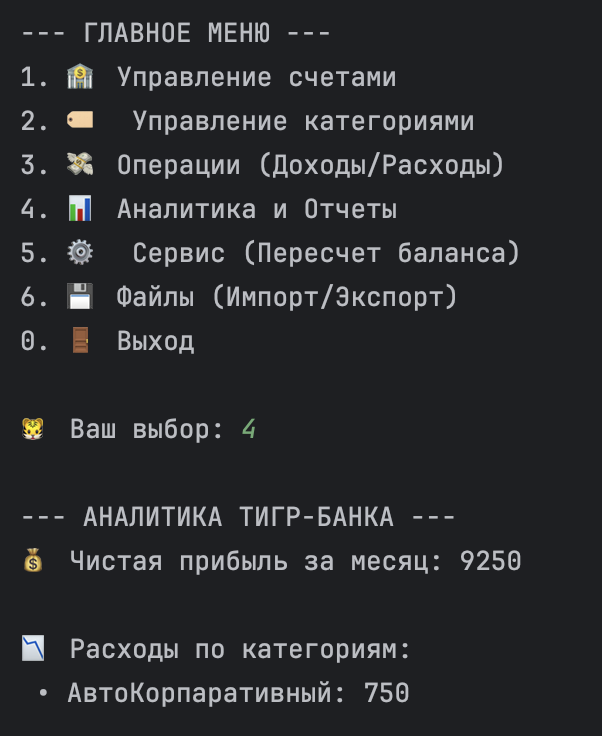
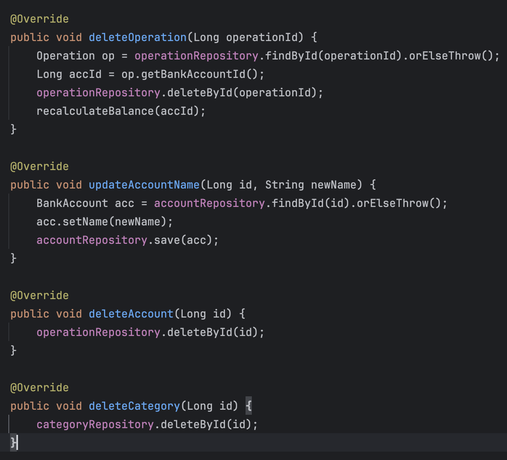
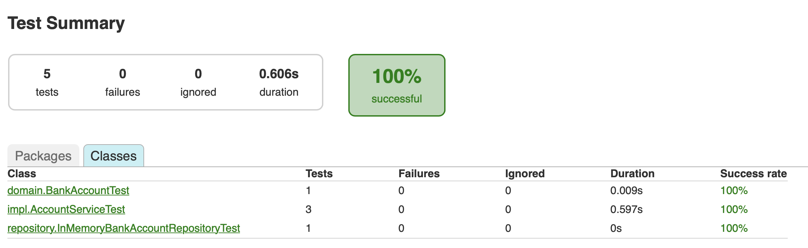
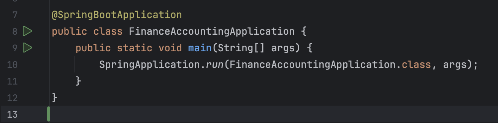
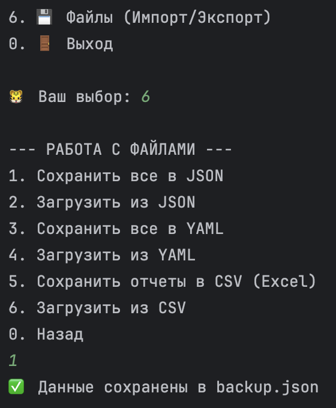
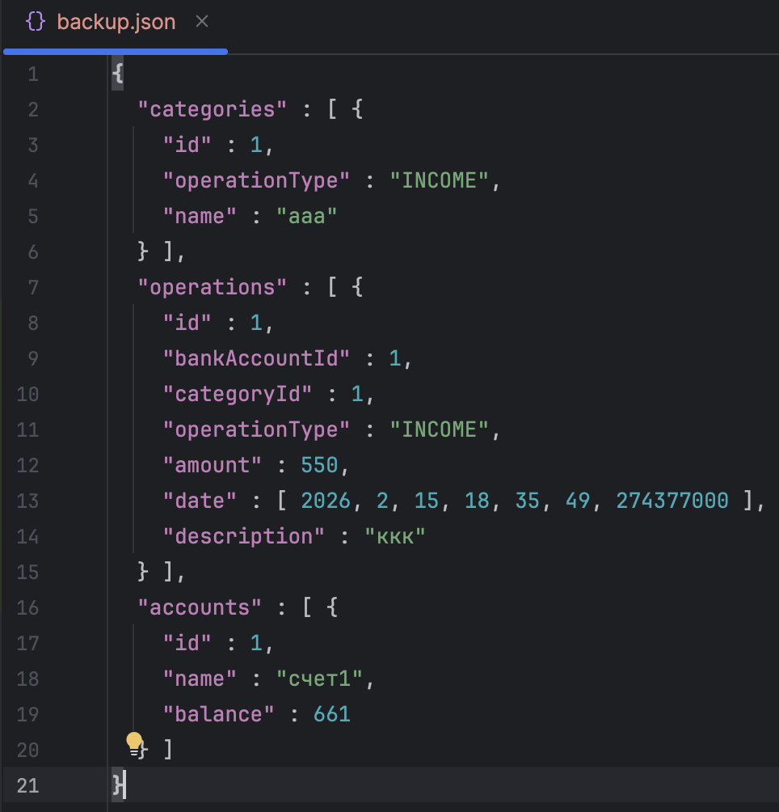

🐯 Финансовая система «Тигр-Банк»
---

### 1. Описание предметной области

Программа моделирует работу персонального банкинга. Основные объекты системы:

* **Счета (BankAccount):** Хранят информацию о владельце и текущем балансе.
* **Категории (Category):** Классифицируют операции на «Доходы» и «Расходы».
* **Операции (Operation):** Фиксируют каждое движение средств с привязкой ко времени и описанием.

  
   
  <i>Демонстрация интерфейса управления счетами и категориями</i>

---

### 2. Единый Code Style

В проекте соблюдается единый стандарт оформления кода (на базе **Google Java Style Guide**):

  
   
  <i>Соблюдение отступов и структуры</i>

---

### 3. Модульное тестирование

Бизнес-логика покрыта тестами с использованием **JUnit 5** и **Mockito**.

  
   
  <i>Все тесты  пройдены успешно</i>

---

### 4. Соблюдение принципов SOLID

* **S:** Своя задача для каждого сервиса.
* **O:** Расширяемость без изменения ядра.
* **L:** Стабильность интерфейсов.
* **I:** Разделение ответственности.
* **D:** Внедрение зависимостей через конструкторы.

---

### 5. Взаимодействие через DI-контейнер

Проект использует **Spring IoC Container**.

  
   
  <i>Конфигурация бинов и запуск контекста Spring</i>

---

### 6. Проблемы расширения бизнес-логики

1. **Конкурентность:** Необходима транзакционность при многопоточности.
2. **Производительность:** Нужны snapshots баланса для больших объемов данных.

---

### 7. Аргументы в пользу абстракций

Интерфейсы позволили изолировать UI от данных и легко проводить тестирование через Mock-объекты.

---

### 8. Работа с данными из файлов

Реализован механизм импорта и экспорта в форматах **JSON**, **YAML** и **CSV**.

  
   
  
   
  <i>Файлы бэкапа и внутренняя структура хранилища</i>

